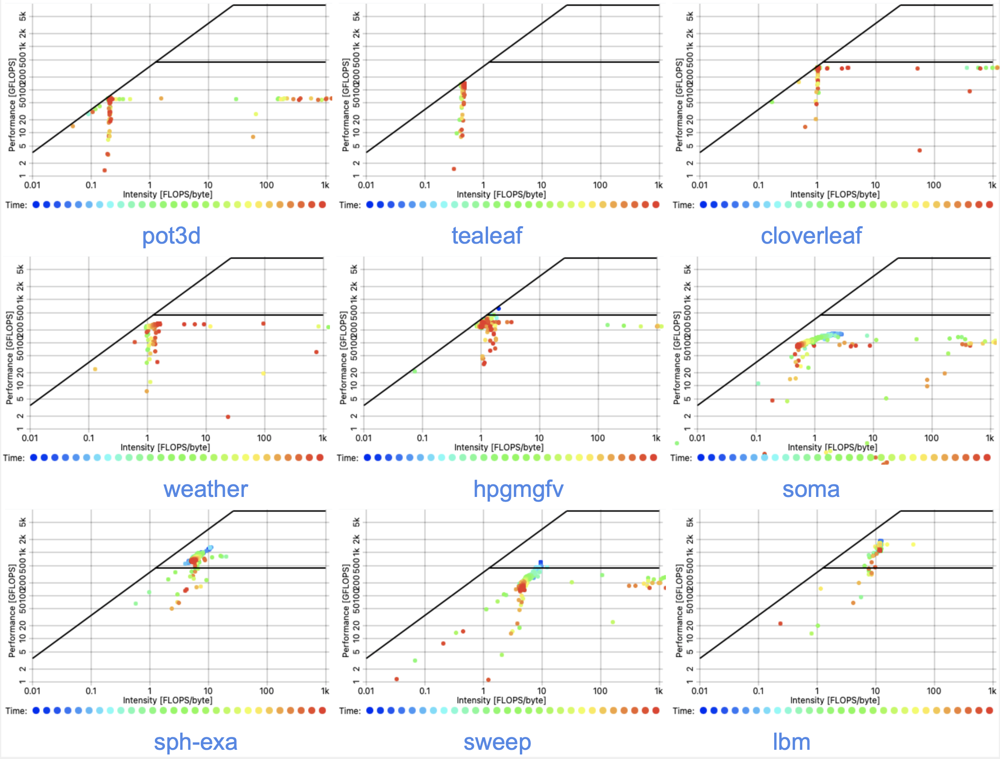

# Artifact Description (AD) / Artifact Evaluation (AE)
# Title: SPEChpc 2021 Benchmarks on Ice Lake and Sapphire Rapids Infiniband Clusters: A Performance and Energy Case Study

### Table of Contents

* [A. Abstract](#Abstract)
* [B. Description](#Description)
    * [B.1 Check-list (artifact meta information)](#Check-list)
        * [B1.1.1 Algorithms and Programs](#Programs)
        * [B1.1.2 Compilation](#Compilation)
        * [B1.1.3 Binary](#Binary)
        * [B1.1.4 Hardware](#Hardware)
        * [B1.1.5 Run-time environment and state](#state)
        * [B1.1.6 Output](#Output)
        * [B1.1.7 Publicly available?](#available)
    * [B.2. How software can be obtained (if available)](#software)
    * [B.3. Hardware dependencies](#HWD)
    * [B.4. Software dependencies](#SWD)
    * [B.5. Datasets](#Datasets)
* [C. Installation](#Installation)
* [D. Experiment workflow](#WF)
* [E. Evaluation and expected result](#Evaluation)
* [D. Experiment workflow](#WF)
* [F. Experiment customization](#Experiment)
* [G. Results Analysis Discussion](#Results)
* [H. Summary](#Summary)
* [I. Notes](#Notes)

<a name="Abstract"></a>
## A. Abstract
In this work, fundamental performance, power, and energy characteristics of the full SPEChpc 2021 benchmark suite 
are assessed on two different clusters based on Intel Ice Lake and Sapphire Rapids CPUs using the MPI-only codes' variants. 
We use memory bandwidth, data volume, and scalability metrics in order to categorize the benchmarks and pinpoint relevant 
performance and scalability bottlenecks on the node and cluster levels. Common patterns such as memory bandwidth limitation, 
dominating communication and synchronization overhead, MPI serialization, superlinear scaling, and alignment issues could be 
identified, in isolation or in combination, showing that SPEChpc 2021 is representative of many HPC workloads. 
Power dissipation and energy measurements indicate that the modern Intel server CPUs have such a high idle power level that 
race-to-idle is the paramount strategy for energy to solution and energy-delay product minimization. 
On the chip level, only memory-bound code shows a clear advantage of Sapphire Rapids compared to Ice Lake in terms of energy to solution.

<a name="Description"></a>
## B. Description

To allow a third party to duplicate the findings, this article provides reproducibility initiative dependencies (Artifact Description or Artifact Evaluation or Computational Results Analysis) appendix at [https://doi.org/10.5281/zenodo.8338037](https://doi.org/10.5281/zenodo.8338037). 
In addiotion to our extensive performance data artifact, it further describes details regarding the software environments, experimental design, and methodology employed for the results shown in the paper, entitled "SPEChpc 2021 Benchmarks on Ice Lake and Sapphire Rapids Infiniband Clusters: A Performance and Energy Case Study". 
The computational artifacts will enable experienced performance engineers to reproduce and interpret the data shown in the paper in the appropriate way and to follow the conclusions we draw from it.

<a name="Check-list"></a>
### B.1 Check-list (artifact meta information)

<a name="Programs"></a>

- **B1.1.1 Algorithms and Programs**: We employed MPI parallel programming model for all nine SPEChpc 2021 benchmarks.
```
1. lbm  -- Lattice-Boltzmann Method D2Q37 -- 2D CFD solver
2. soma  -- Monte-Carlo acceleration for soft coarse grained polymers  -- physics or polymeric systems
3. tealeaf -- Solving the linear heat conduction equation on a 2D regular grid using a 5-point stencil with implicit solvers  -- physics or high energy physics
4. cloverleaf  -- Solving compressible Euler equations on a 2D Cartesian grid using an explicit second-order accurate method  -- physics or high energy physics
5. minisweep  -- A successor to the well-known Sweep3D benchmark  -- radiation transport in nuclear engineering
6. pot3D  -- Computing potential field solutions using a preconditioned CG sparse solver for the Laplace equation in 3D spherical coordinates  -- solar physics
7. sph-exa  -- Smoothed Particle Hydrodynamics, a meshless Lagrangian method  -- astrophysics and cosmology
8. hpgmgfv -- Finite-volume-based High Performance Geometric Multigrid solving variable-coefficient elliptic problems on Cartesian grids -- cosmology, astrophysics, combustion
9. weather -- A traditional finite-volume control flow -- atmospheric weather and climate 
```

<a name="Compilation"></a>

- **B1.1.2 Compilation**: Multiple programming languages (C, C++, and Fortran) are employed by all nine SPEChpc 2021 parallel benchmarks.
```
C: "mpiicc"	     
CXX: "mpiicpc"
Fortran: "mpiifort"
STD optimizations: "-O3 -ansi-alias"
SIMD optimizations: "-xCORE-AVX512 -qopt-zmm-usage=high"
ITAC data collection for MPI and user-specific functions specified in "func.txt" file: "-trace -tcollect -tcollect-filter func.txt -qopt-report"
LIKWID INCLUDES: "-I${LIKWID_INCDIR} -DLIKWID_PERFMON"
LIKWID LIBS: "-llikwid -L${LIKWID_LIBDIR}"
```

<a name="Binary"></a>

- **B1.1.3 Binary**
```
x86
```

<a name="Hardware"></a>

- **B1.1.4 Hardware** 

     - ClusterA: 36 core Intel Xeon Ice Lake (Platinum 8360Y) CPUs and HDR-100 InfiniBand 
     - ClusterB: 52 core Intel Xeon Sapphire (Platinum 8470) Rapids CPUs and HDR-100 InfiniBand 
      
Further information on hardware is available in Table 3 of the paper.

<a name="state"></a>

- **B1.1.5 Run-time environment and state**:
A thorough state description of the two systems that were utilized to conduct the experiments can be found in [`ClusterA_state.csv`](ClusterA_state.csv) and [`ClusterB_state.csv`](ClusterB_state.csv).
This lists comprehensive hardware information on 

     - libraries and compilers along with their versions 
     - operating system kernel, version and other details
     - CPUset
     - topology (cores, cache, NUMA)
     - NUMA balancing
     - general memory details 
     - transparent huge pages
     - performance energy bias
     - hardware power limits

<a name="Output"></a>

- **B1.1.6 Output**

     - Performance, power and energy metrics presented in the paper:

          - `speedup` --- Figure 1 and 5
          - `performance [GFlop/s]` (total, scalar, vectorized) --- Figure 1
          - `per-node total Bandwidth [GByte/s]` (memory, L3 cache, L2 cache) --- Figure 2 and 5
          - `aggregated data volume [GByte]` (per-node memory, L3 cache, L2 cache) --- Figure 2 and 5
          - `power [Watt]` (total, chip, DRAM) --- Figure 3 and 6
          - `energy [Joule]` (total, chip, DRAM) --- Figure 4 and 6

     - Navigate to the [Output_tiny_ClusterA](Output_tiny_ClusterA), [Output_small_ClusterA](Output_small_ClusterA), [Output_tiny_ClusterB](Output_tiny_ClusterB) and [Output_small_ClusterB](Output_small_ClusterB) for additional thoroughly investigated performance, power and energy results, which are outside the paper:

          - `runtime` [s]  
          - `cycles per instruction, CPI`
          - `FP arithmetic instructions` (scalar, packed 128 B, packed 256 B, packed 512 B)
          - `memory and caches bandwidth [GBytes/s]` (total, read, write)
          - `memory and caches data volume [GByte]` (total, read, write)
          - `operational intensity [F/B]`
          - `translation lookaside buffer, TLB` (load misses, store misses)

     - Navigate to the `ITAC-output` repository at [https://doi.org/10.5281/zenodo.8338037](https://doi.org/10.5281/zenodo.8338037) for additional trace visualization presented, which are outside the paper:

          - `processes timeline` (program structure for functions, messages and collectives operations)
          - `message profile` (messages volume, time, count, transfer rate, communication hotspots and patterns)
          - `function profile` (functions statistics, call tree)
          - `load imbalance`

<a name="available"></a>

- **B1.1.7 Publicly available?**
```
yes
```

<a name="software"></a>
### B.2. How software can be obtained (if available)
To download softwares, check out the following website.

* SPEChpc 2021 parallel benchmarks: [https://spec.org/hpc2021](https://spec.org/hpc2021)
* Intel C++ compiler: [https://software.intel.com/content/www/us/en/develop/tools/oneapi/components/dpc-compiler.html](https://software.intel.com/content/www/us/en/develop/tools/oneapi/components/dpc-compiler.html)
* Intel MPI library: [https://intel.com/content/www/us/en/developer/tools/oneapi/mpi-library.html](https://intel.com/content/www/us/en/developer/tools/oneapi/mpi-library.html)
* Intel Trace Analyzer and Collector: [https://software.intel.com/en-us/trace-analyzer](https://software.intel.com/en-us/trace-analyzer)
* LIKWID: [https://github.com/RRZE-HPC/likwid](https://tiny.cc/LIKWID)

<a name="HWD"></a>
### B.3. Hardware dependencies
Experiments were conducted on ClusterA (Intel Xeon Ice Lake CPUs) at base clock-frequency of 2.4 GHz (fixed, turbo disabled), and on ClusterB (Intel Xeon Sapphire Rapid CPUs) at base clock-frequency of  2.0 GHz (fixed, turbo disabled).
The reproducibility of experiments requires mapping consecutive MPI processes to consecutive cores and fixing the frequency and switching-off the turbo mode.
For node-level analysis of Section 4, as the RAPL measurements often differ between nodes, all nine benchmarks employed the same node. 


<a name="SWD"></a>
### B.4. Software dependencies
* [SPEChpc 2021 parallel benchmarks](https://spec.org/hpc2021), version 2021, update 1.0.3
* [Intel C++ compiler](https://software.intel.com/content/www/us/en/develop/tools/oneapi/components/dpc-compiler.html), version 2022, update 1
* [Intel MPI library](https://www.intel.com/content/www/us/en/developer/tools/oneapi/mpi-library.html), version 2021, update 7
* Analyzing results metrics
     * [Intel Trace Analyzer and Collector](https://software.intel.com/en-us/trace-analyzer), version 2021, update 6
     * [LIKWID](https://tiny.cc/LIKWID), version 2023, update 5.2.2 and 5.2.2/saprap1 (beta)
* Monitoring results metrics: [ClusterCockpit](https://monitoring.nhr.fau.de), version 2023, update 1.0.0

<a name="Datasets"></a>
### B.5. Datasets
To accommodate the varying system sizes required for single and multi-node analysis, two distinct workloads were employed.

1. `"tiny"` workloads
     * designed to run on clusters using 1–256 processes and up to 0.06 TB of memory in accordance with the SPEC documentation
     * we employed up to 72 MPI processes (single node) of clusterA and 104 MPI processes (single node) on clusterB
     * employed for the "single-node analysis" in the Section 4 of the paper
2. `"small"` workloads
     * designed to run on clusters using 64–1024 processes and up to 0.48 TB of memory in accordance with the SPEC documentation
     * we employed up to 1656 MPI processes (23 nodes) on clusterA and 1664 MPI processes (16 nodes) on clusterB
     * employed for the "multi-node analysis" in the Section 5 of the paper

Even though the working sets were large enough to fit in memory, several of the scripts' multi-node scaling showed cache impacts.
Table 1 of the paper contains further information on input setup for both workloads across all nine parallel benchmarks.

<a name="Installation"></a>
## C. Installation
Please install above-mentioned software dependencies.

<a name="WF"></a>
## D. Experiment workflow
To reproduce the experimental results, download benchmark codes from the [SPEChpc 2021 website](https://spec.org/hpc2021) and then git clone the following repository:
```
git clone https://github.com/RRZE-HPC/PMBS23-AD && cd PMBS23-AD/
```
To run MPI-parallel SPEChpc 2021 codes, the description for compiling and running can be found in the [README.md](README) files available at the [Benchmarks_tiny/Compile](Benchmarks_tiny/Compile/README), [Benchmarks_small/Compile](Benchmarks_small/Compile/README), [Benchmarks_tiny/Run](Benchmarks_tiny/Run/README) and [Benchmarks_small/Run](Benchmarks_small/Run/README).
The executable must be in `$PATH` and the likwid markers can be inserted by hand, if needed.
Enforce process-core affinity using the `likwid-mpirun startup wrapper` (SMT feature disabled). 
Fix frequencies to the base values of their respective CPUs and disable turbo mode via the SLURM batch scheduler:
```
--cpu-freq=2400000-2400000:performance
```

Generate performance, power and energy results using the workload configuration available in the [Compile](Benchmarks_small/Compile) folder and scripts available in the [scripts](Benchmarks_small/Run/scripts) folder of each code in the `tiny` (Benchmarks_tiny) and `small` (Benchmarks_small) benchmark suites. 

<a name="Evaluation"></a>
## E. Evaluation and expected result
Validation of our performance, power and energy results was done by applying comparison with experimental collected other fundamental resource metrics defined in the [B1.1.6 Output](#Output) section above.
Run the benchmarks according to the README file and compare the results in the paper. 
Navigate to the `Output_*` directory to access the stored measured results.
If executed on the same hardware as described, we anticipate that these figures will be within the bounds of those in the paper.
If the measurements differ, different compiler choices, turbo mode, frequency scaling, interference with energy-saving features, and other factors could be the cause.


<a name="Experiment"></a>
## F. Experiment customization
All nine SPEChpc 2021 benchmarks were made stand-alone benchmarks without the SPEChpc standard harness with help of a script.
We took a number of measures to create a reproducible experimental environment and minimize any noise from system sources.
Before actual measurements were taken, at least two warm-up time steps with barrier synchronization were performed to allow the MPI runtimes to settle and eliminate first-call overhead. 
Individual benchmark results were repeated at least 15 times and we report statistical fluctuations if they were significant.
Access to hardware performance counters was made feasible for likwid-perfctr with the aid of `-C hwperf` option.

<a name="Results"></a>
## G. Results analysis discussion
Memory bandwidth measurements (ratio of data volume and wall-clock time) were obtained using the `likwid-perfctr` from the LIKWID tool suite. 
The `likwid-perfctr` abstracts away the hardware event names on different architectures by providing a high-level memory traffic and bandwidth.
The expected clock frequency was verified with the likwid-perfctr tool, which was also used for reading hardware performance events and to validate data traffic where necessary. 
Communication delays for non-blocking calls were measured by time spent in the `MPI_Waitall` function. 

### Roofline monitoring of performance scaling



In the above figure, we show graphs from the online monitoring system on ClusterA. Each dot is generated from a ten-second measurement (every minute) of the computational intensity and the performance, averaged over all nodes of the job. 
Each job contained a scaling run from one to 14 nodes, so the data shows how the computational intensity and the per-node performance develops over time and, thus, with growing node count (denoted by the blue-green-red color scale). 
Red points have a considerably higher weight because the larger-scale runs execute in rather short time (strong scaling).
The plots in the figure are arranged according to memory bandwidth: the first four are memory-bound and the final five are non-memory-bound.
Plots clearly demonstrate that `weather` has a combination of memory-bound and non-memory-bound kernels; in `soma`, it appears that code parts of very different characteristics are integrated over by the ten-second measurement interval. 
The cloud's position in the non-memory-bound `lbm` code implies that although it needs data, the work is done in the core.

<a name="Summary"></a>
## H. Summary
Please see the `upshots` and Section 6 of the paper that presents the summary.

<a name="Notes"></a>
## I. Notes
Please cite the work as:

* A. Afzal, G. Hager, and G. Wellein: SPEChpc 2021 Benchmarks on Ice Lake and Sapphire Rapids Infiniband Clusters: A Performance and Energy Case Study. [DOI:10.1145/3624062.3624197](https://doi.org/10.1145/3624062.3624197)

Bibtex:  
> @INPROCEEDINGS{SPEC2023,    
>   author = {Afzal, Ayesha and Hager, Georg and Wellein, Gerhard},  
>   title={{SPEChpc} {2021} Benchmarks on Ice Lake and Sapphire Rapids Infiniband Clusters{:} A Performance and Energy Case Study},  
>   booktitle={2023 IEEE/ACM Performance Modeling, Benchmarking and Simulation of High Performance Computer Systems (PMBS)},      
>   doi={10.1145/3624062.3624197},   
>   year={2023}
> }

* A. Afzal, G. Hager, and G. Wellein: SPEChpc 2021 Benchmarks on Ice Lake and Sapphire Rapids Infiniband Clusters: A Performance and Energy Case Study -- Performance Data Artifact Appendix. [DOI:10.5281/zenodo.8338037](https://doi.org/10.5281/zenodo.8338037)

Bibtex:  
> @INPROCEEDINGS{SPECAD2023,  
>   author = {Afzal, Ayesha and Hager, Georg and Wellein, Gerhard},   
>   title = {{SPEChpc} {2021} Benchmarks on Ice Lake and Sapphire Rapids Infiniband Clusters{:} A Performance and Energy Case Study {--} Performance Data Artifact Appendix},   
>   booktitle = {[Online]},   
>   doi = {10.5281/zenodo.8338037},   
>   year = {2023}   
> }


